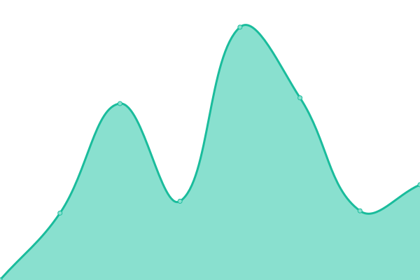
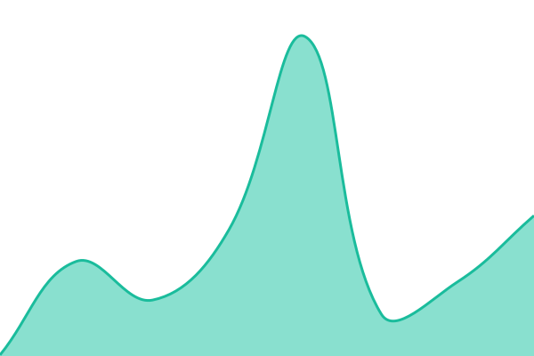

# [📈 Live Status](https://Rentr-UK.github.io/Rentmigo-uptime): <!--live status--> **🟩 All systems operational**

This repository contains the open-source uptime monitor and status page for [Rentr-UK](https://Rentr-UK.github.io/Rentmigo-uptime), powered by [Upptime](https://github.com/upptime/upptime).

With [Upptime](https://upptime.js.org), you can get your own unlimited and free uptime monitor and status page, powered entirely by a GitHub repository. We use [Issues](https://github.com/Rentr-UK/Rentmigo-uptime/issues) as incident reports, [Actions](https://github.com/Rentr-UK/Rentmigo-uptime/actions) as uptime monitors, and [Pages](https://Rentr-UK.github.io/Rentmigo-uptime) for the status page.

<!--start: status pages-->
<!-- This summary is generated by Upptime (https://github.com/upptime/upptime) -->
<!-- Do not edit this manually, your changes will be overwritten -->
<!-- prettier-ignore -->
| URL | Status | History | Response Time | Uptime |
| --- | ------ | ------- | ------------- | ------ |
|  [[Prod] Website](https://rentmigo.co.uk) | 🟩 Up | [prod-website.yml](https://github.com/Rentr-UK/Rentmigo-uptime/commits/HEAD/history/prod-website.yml) | 

 1255ms
     
 | 

<a href="https://Rentr-UK.github.io/Rentmigo-uptime/history/prod-website">100.00%</a>
    

|  [[Prod] Login](https://rentmigo.co.uk/login) | 🟩 Up | [prod-login.yml](https://github.com/Rentr-UK/Rentmigo-uptime/commits/HEAD/history/prod-login.yml) | 

 403ms
     
 | 

<a href="https://Rentr-UK.github.io/Rentmigo-uptime/history/prod-login">100.00%</a>
    

|  [[Prod] API Health Check](https://rentmigo.co.uk/api/v1/health) | 🟩 Up | [prod-api-health-check.yml](https://github.com/Rentr-UK/Rentmigo-uptime/commits/HEAD/history/prod-api-health-check.yml) | 

 1060ms
     
 | 

<a href="https://Rentr-UK.github.io/Rentmigo-uptime/history/prod-api-health-check">100.00%</a>
    

|  [[Staging] Website](https://staging.rentmigo.co.uk) | 🟩 Up | [staging-website.yml](https://github.com/Rentr-UK/Rentmigo-uptime/commits/HEAD/history/staging-website.yml) | 

 3312ms
     
 | 

<a href="https://Rentr-UK.github.io/Rentmigo-uptime/history/staging-website">100.00%</a>
    

|  [[Staging] Login](https://staging.rentmigo.co.uk/login) | 🟩 Up | [staging-login.yml](https://github.com/Rentr-UK/Rentmigo-uptime/commits/HEAD/history/staging-login.yml) | 

 609ms
     
 | 

<a href="https://Rentr-UK.github.io/Rentmigo-uptime/history/staging-login">100.00%</a>
    

|  [[Staging] API Health Check](https://staging.rentmigo.co.uk/api/v1/health) | 🟩 Up | [staging-api-health-check.yml](https://github.com/Rentr-UK/Rentmigo-uptime/commits/HEAD/history/staging-api-health-check.yml) | 

 1795ms
     
 | 

<a href="https://Rentr-UK.github.io/Rentmigo-uptime/history/staging-api-health-check">100.00%</a>
    

|  [Vercel](https://www.vercel-status.com/api/v2/status.json) | 🟩 Up | [vercel.yml](https://github.com/Rentr-UK/Rentmigo-uptime/commits/HEAD/history/vercel.yml) | 

 203ms
     
 | 

<a href="https://Rentr-UK.github.io/Rentmigo-uptime/history/vercel">100.00%</a>
    

|  [Neon](https://api.status.io/1.0/status/6878fc85709daa75be6c7e3c) | 🟩 Up | [neon.yml](https://github.com/Rentr-UK/Rentmigo-uptime/commits/HEAD/history/neon.yml) | 

 262ms
     
 | 

<a href="https://Rentr-UK.github.io/Rentmigo-uptime/history/neon">100.00%</a>
    

|  [Stripe](https://status.stripe.com/current) | 🟩 Up | [stripe.yml](https://github.com/Rentr-UK/Rentmigo-uptime/commits/HEAD/history/stripe.yml) | 

 198ms
     
 | 

<a href="https://Rentr-UK.github.io/Rentmigo-uptime/history/stripe">100.00%</a>
    

|  [Inngest](https://status.inngest.com/api/v2/status.json) | 🟩 Up | [inngest.yml](https://github.com/Rentr-UK/Rentmigo-uptime/commits/HEAD/history/inngest.yml) | 

 321ms
     
 | 

<a href="https://Rentr-UK.github.io/Rentmigo-uptime/history/inngest">100.00%</a>
    

<!--end: status pages-->

[**Visit our status website →**](https://Rentr-UK.github.io/Rentmigo-uptime)

## 📄 License

- Powered by: [Upptime](https://github.com/upptime/upptime)
- Code: [MIT](./LICENSE) © [Anand Chowdhary](https://anandchowdhary.com), supported by [Pabio](https://pabio.com)
- Data in the `./history` directory: [Open Database License](https://opendatacommons.org/licenses/odbl/1-0/)
